# Poverty Line

---

## SCREENSHOTS

<<<<<<< HEAD

=======
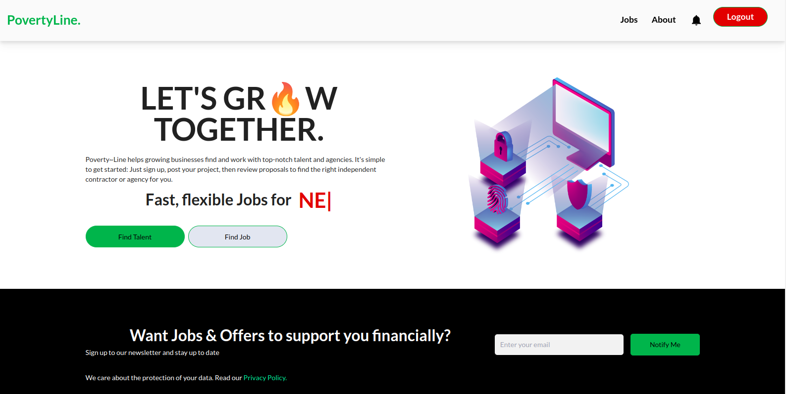
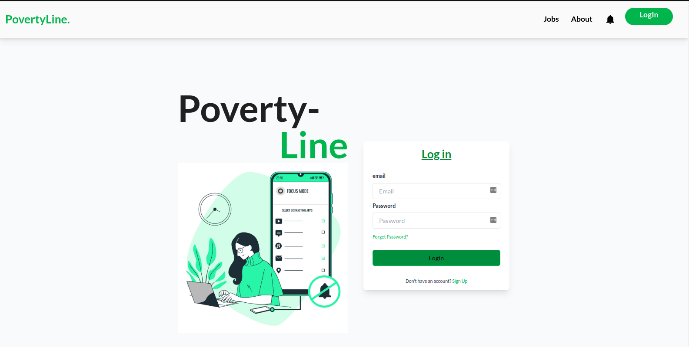
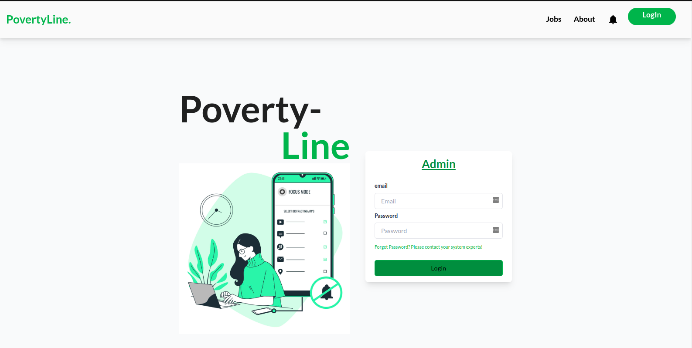
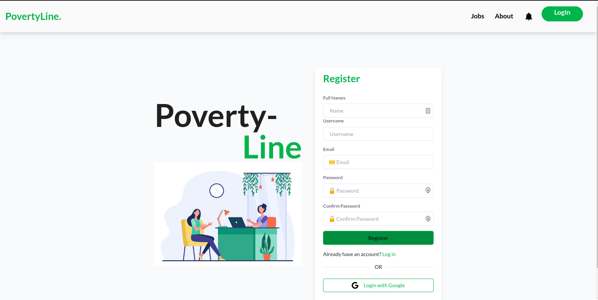
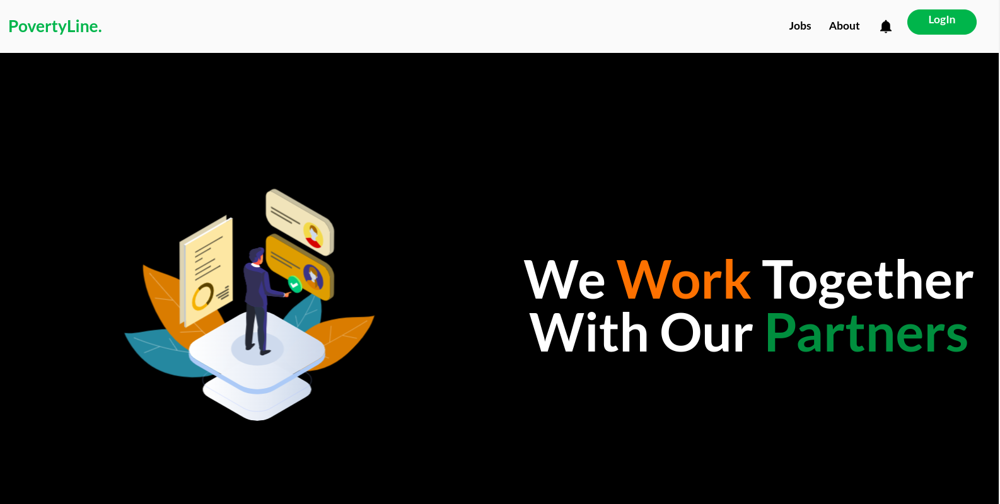
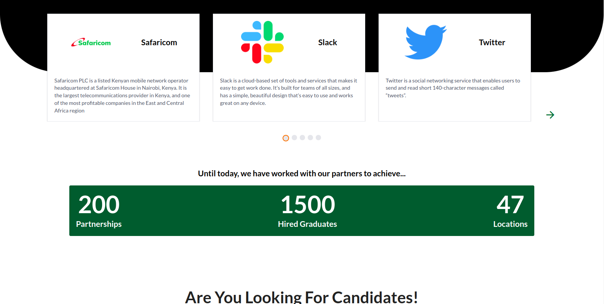
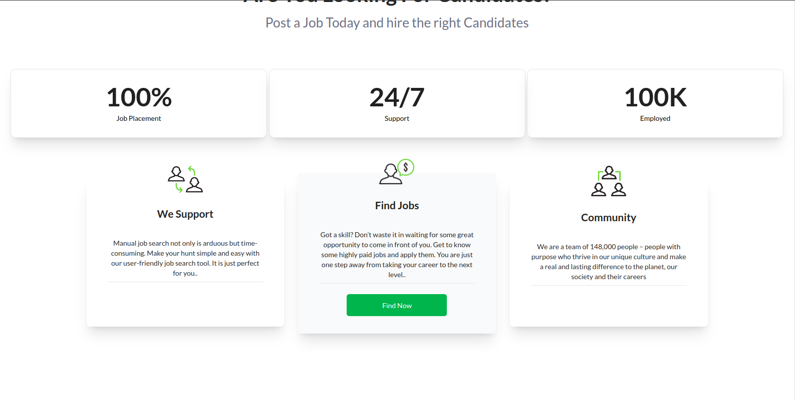
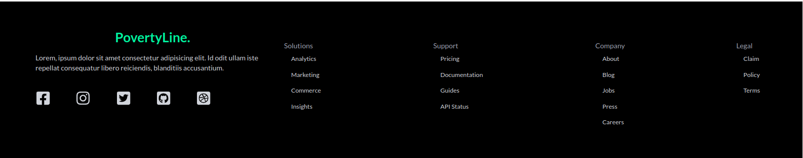

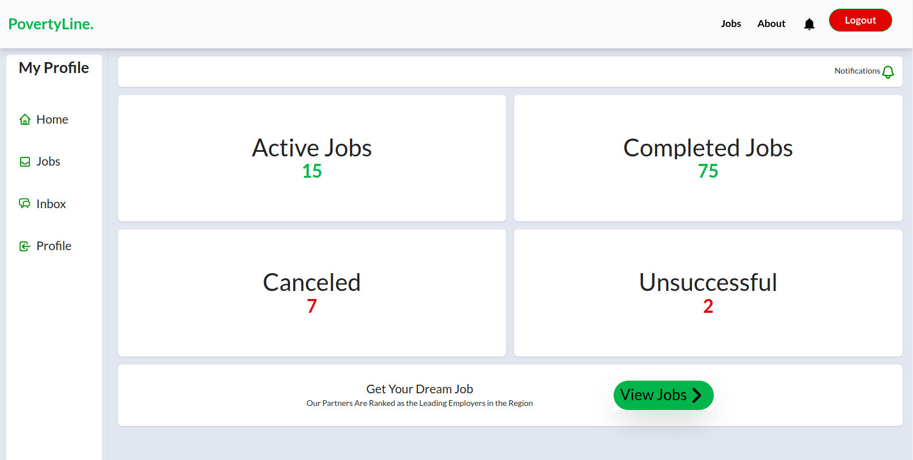
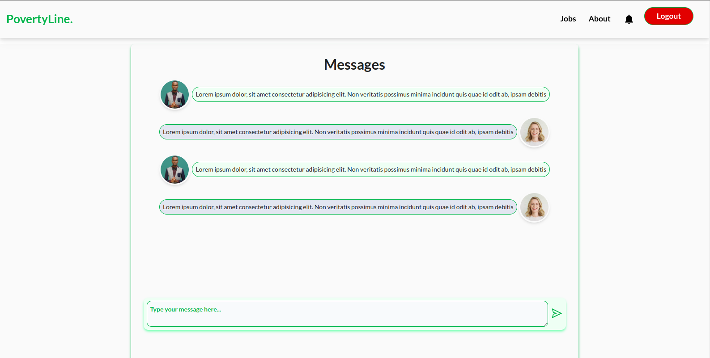
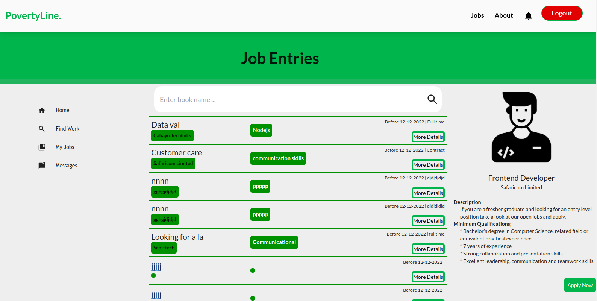
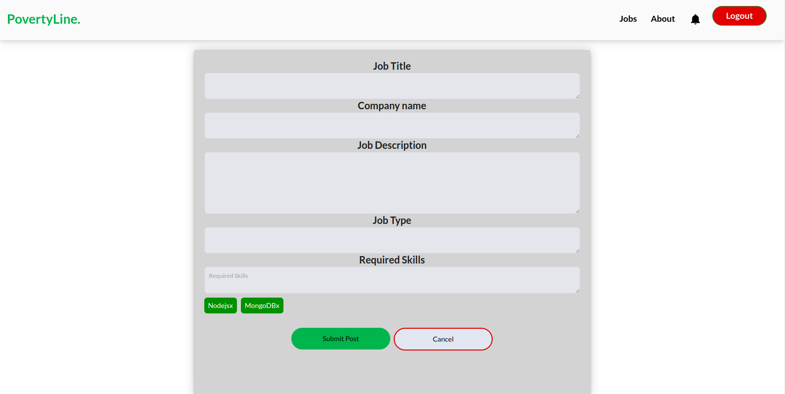
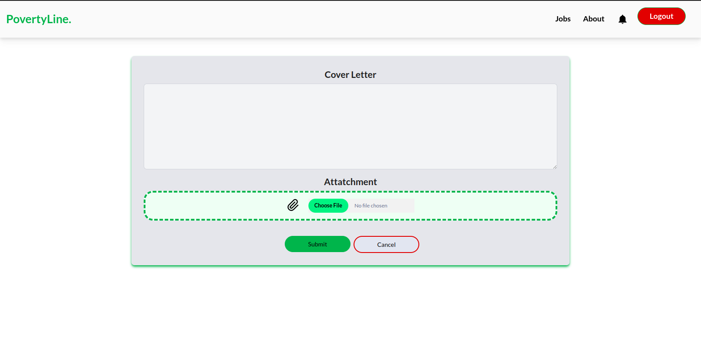
>>>>>>> 7ce17bdc0be33ee990a8c0839b0fccc2662f7be4

---

## Contributors

| Name | Operation | LinkedIn | Email |
|:----:|:--:|:--------:|:-----:|
|Alemba Alex | Frontend and UI/UX | http://www.linkedin.com/in/alex-kiragu-754690219 | alembakiragu@gmail.com |
<<<<<<< HEAD
| Earnest Achayo | write your operation | LinkedIn profile link | Your Email |
=======
| Earnest Achayo | Backend developer | https://www.linkedin.com/in/earnest-achayo-3a8295244 | earnytechlive@gmail.com |
>>>>>>> 7ce17bdc0be33ee990a8c0839b0fccc2662f7be4
| Snaida Kabalika | write your operation | LinkedIn profile link | Your Email |
| Bryan Bosire | write your operation | LinkedIn profile link | Your Email |
| Tim Mailu | write your operation | LinkedIn profile link | Your Email |
| Joseph Maina | write your operation | LinkedIn profile link | Your Email |

---

## Table of Content

-[Description](#description)

-[Features](#features)

-[Requirements](#requirements)

-[Installation process](#installation-process)
<<<<<<< HEAD

-[Live Link](#live-link)

-[Technologies Used](#technologies-used)

-[Contact Information](#contact-information)

-[License](#license)

---

=======

-[Live Link](#live-link)

-[Technologies Used](#technologies-used)

-[Contact Information](#contact-information)

-[License](#license)

---

>>>>>>> 7ce17bdc0be33ee990a8c0839b0fccc2662f7be4
### Description

This is the front End for the Poverty-line website. Poverty~Line helps growing businesses find and work with top-notch talent and agencies. Users can sign up, post projects and review proposals to find the right independent contractor or agency for you

---

### Features

- Admin for the site can post new jobs for suitable applicants to apply
- Admin can perform CRUD operations(create, read, update, delete) users
- Users can create accounts and store the personal information in the database
- Existing users in the database can log in and stay persisted in the system untill the logs out.
- Users can perform CRUD operations(create, read, update, delete) their data

---
<<<<<<< HEAD

### Requirements

*Access to a computer or any other garget

=======

### Requirements

*Access to a computer or any other garget

>>>>>>> 7ce17bdc0be33ee990a8c0839b0fccc2662f7be4
*Access to the internet

---

### Installation Process

****

*Clone the repo: 
<<<<<<< HEAD

*Unzip the downloaded files in a folder of choice.

*Open the index files from the zipped file with any browser.
****

=======

*Unzip the downloaded files in a folder of choice.

*Open the index files from the zipped file with any browser.
****

>>>>>>> 7ce17bdc0be33ee990a8c0839b0fccc2662f7be4
[Go Back to the top](#poverty-line)

---

### Live Link

<<<<<<< HEAD
-Click this link to view the application: https://github.com/joseph3559/poverty-line
=======
-Click this link to view the application Frontend: http://poverty-line.vercel.app/

-Click this link to view the application Backend: https://powerful-dusk-77185.herokuapp.com/
>>>>>>> 7ce17bdc0be33ee990a8c0839b0fccc2662f7be4

---

### Technologies Used

1. React
2. JSX
3. Tailwind
4. Ruby on Rails
5. Material Ui
6. Figma
7. CSS
8. Trello
9. Redux

---

### Contact Information

- Email : povertylinedev@gmail.com

---

## [License](LICENSE)

MIT License
Copyright (c) 2022 Poverty Line

[Go Back to the top](#poverty-line)
<<<<<<< HEAD

=======
>>>>>>> 7ce17bdc0be33ee990a8c0839b0fccc2662f7be4
